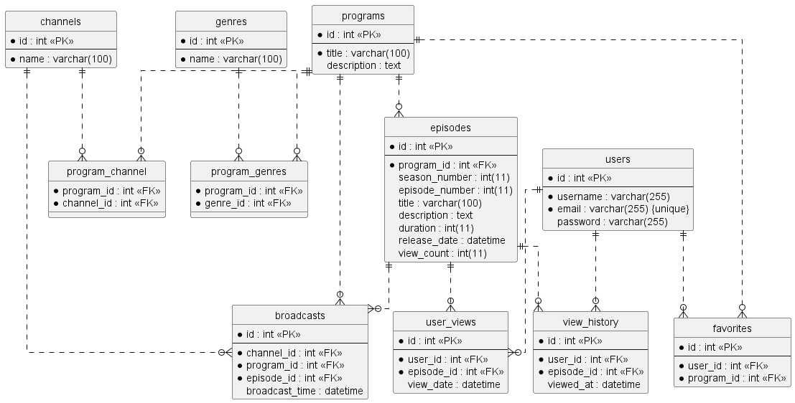

# インターネットTV

## ステップ1: テーブル設計


<details>
<summary>エンティティの定義</summary>
<p>

### 1.  channels:
テレビチャンネルを表します。各チャンネルは一意のIDと名前を持ちます。

    -   id: チャンネルの一意の識別子です。
    -   name: チャンネルの名前です。

### 2.   users:
サービスのユーザーを表します。各ユーザーは一意のID、ユーザー名、メールアドレス、パスワードなどを持ちます。

     -   id: ユーザーの一意の識別子です。
     -   username: ユーザー名です。
     -   email: ユーザーのメールアドレスです。
     -   password: ユーザーのパスワードです。

### 3.  programs:
テレビ番組を表します。各番組は一意のID、タイトル、および説明を持ちます。

    -   id: 番組の一意の識別子です。
    -   title: 番組のタイトルです。
    -   description: 番組の詳細説明です。

### 4.  genres:
ジャンルを表します。各ジャンルは一意のIDと名前を持ちます。

    -   id: ジャンルの一意の識別子です。
    -   name: ジャンルの名前です。

### 5.  program_channel:
番組とチャンネルの関連を表します。番組は複数のチャンネルで放送されることがあります。

    -   program_id: 番組の一意の識別子です。
    -   channel_id: チャンネルの一意の識別子です。

### 6.  program_genres:
番組とジャンルの関連を表します。番組は複数のジャンルに属することがあります。

    -   program_id: 番組の一意の識別子です。
    -   genre_id: ジャンルの一意の識別子です。

### 7.  episodes:
番組のエピソードを表します。各エピソードは一意のID、番組ID、シーズン番号、エピソード番号、タイトル、説明、放映時間、公開日、視聴数を持ちます。

    -   id: エピソードの一意の識別子です。
    -   program_id: 番組の一意の識別子です。
    -   season_number: シーズンの番号です。
    -   episode_number: エピソードの番号です。
    -   title: エピソードのタイトルです。
    -   description: エピソードの詳細説明です。
    -   duration: エピソードの放映時間です。
    -   release_date: エピソードの公開日です。
    -   view_count: エピソードの視聴数です。

### 8.  broadcasts:
放送スケジュールを表します。各放送は一意のID、チャンネルID、番組ID、エピソードID、放送時間を持ちます。

    -   id: 放送の一意の識別子です。
    -   channel_id: チャンネルの一意の識別子です。
    -   program_id: 番組の一意の識別子です。
    -   episode_id: エピソードの一意の識別子です。
    -   broadcast_time: 放送時間です。

### 9.   user_views:
ユーザーがどのエピソードを視聴したかを追跡します。各視聴は一意のID、ユーザーID、エピソードID、視聴日時を持ちます。

     -   id: 視聴の一意の識別子です。
     -   user_id: ユーザーの一意の識別子です。
     -   episode_id: エピソードの一意の識別子です。
     -   view_date: 視聴日時です。

### 10.   favorites:
ユーザーがお気に入りに追加した番組を追跡します。各お気に入りは一意のID、ユーザーID、番組IDを持ちます。

      -   id: お気に入りの一意の識別子です。
      -   user_id: ユーザーの一意の識別子です。
      -   program_id: 番組の一意の識別子です。

### 11. view_history:
ユーザーが視聴したエピソードの履歴を表します。各エントリは一意のID、ユーザーID、エピソードID、視聴日時を持ちます。

    -   id: 視聴履歴エントリの一意の識別子です。
    -   user_id: ユーザーの一意の識別子です。
    -   episode_id: エピソードの一意の識別子です。
    -   viewed_at: 視聴日時です。

</p>
</details>


<details>
<summary>テーブル設計</summary>
<p>

## テーブル：channels

| カラム名 | データ型 | NULL | キー | 初期値 | AUTO INCREMENT |
| --- | --- | --- | --- | --- | --- |
| id | int |  | PRIMARY |  | YES |
| name | varchar(100) |  |  |  |  |

## テーブル：users

| カラム名 | データ型 | NULL | キー | 初期値 | AUTO INCREMENT |
| --- | --- | --- | --- | --- | --- |
| id | int |  | PRIMARY |  | YES |
| username | varchar(255) |  |  |  |  |
| email | varchar(255) |  | INDEX |  |  |
| password | varchar(255) |  |  |  |  |

-   ユニークキー制約：email カラムに対して設定

## テーブル：programs

| カラム名 | データ型 | NULL | キー | 初期値 | AUTO INCREMENT |
| --- | --- | --- | --- | --- | --- |
| id | int |  | PRIMARY |  | YES |
| title | varchar(100) |  |  |  |  |
| description | text |  |  |  |  |

## テーブル：genres

| カラム名 | データ型 | NULL | キー | 初期値 | AUTO INCREMENT |
| --- | --- | --- | --- | --- | --- |
| id | int |  | PRIMARY |  | YES |
| name | varchar(100) |  |  |  |  |


## テーブル：program_channel

| カラム名 | データ型 | NULL | キー | 初期値 | AUTO INCREMENT |
| --- | --- | --- | --- | --- | --- |
| program_id | int |  | PRIMARY |  |  |
| channel_id | int |  | PRIMARY |  |  |

-   外部キー制約：program_id に対して、programs テーブルの id カラムから設定
-   外部キー制約：channel_id に対して、channels テーブルの id カラムから設定


## テーブル：program_genres

| カラム名 | データ型 | NULL | キー | 初期値 | AUTO INCREMENT |
| --- | --- | --- | --- | --- | --- |
| program_id | int |  | PRIMARY |  |  |
| genre_id | int |  | PRIMARY |  |  |

-   外部キー制約：program_id に対して、programs テーブルの id カラムから設定
-   外部キー制約：genre_id に対して、 genres テーブルの id カラムから設定

## テーブル：episodes

| カラム名 | データ型 | NULL | キー | 初期値 | AUTO INCREMENT |
| --- | --- | --- | --- | --- | --- |
| id | int |  | PRIMARY |  | YES |
| program_id | int |  | INDEX |  |  |
| season_number | int(11) |  |  |  |  |
| episode_number | int(11) | YES |  |  |  |
| title | varchar(100) |  |  |  |  |
| description | text |  |  |  |  |
| duration | int(11) |  |  |  |  |
| release_date | datetime |  |  |  |  |
| view_count | int(11) |  |  |  |  |

-   外部キー制約：program_id に対して、programs テーブルの id カラムから設定

## テーブル：broadcasts

| カラム名 | データ型 | NULL | キー | 初期値 | AUTO INCREMENT |
| --- | --- | --- | --- | --- | --- |
| id | int |  | PRIMARY |  | YES |
| channel_id | int |  | INDEX |  |  |
| program_id | int |  | INDEX |  |  |
| episode_id | int |  | INDEX |  |  |
| broadcast_time | datetime |  |  |  |  |

-   外部キー制約：channel_id に対して、channels テーブルの id カラムから設定
-   外部キー制約：program_id に対して、programs テーブルの id カラムから設定
-   外部キー制約：episode_id に対して、episodes テーブルの id カラムから設定


## テーブル：user_views

| カラム名 | データ型 | NULL | キー | 初期値 | AUTO INCREMENT |
| --- | --- | --- | --- | --- | --- |
| id | int |  | PRIMARY |  | YES |
| user_id | int |  | INDEX |  |  |
| episode_id | int |  | INDEX |  |  |
| view_date | datetime |  |  |  |  |

-   外部キー制約：user_id に対して、users テーブルの id カラムから設定
-   外部キー制約：episode_id に対して、episodes テーブルの id カラムから設定

## テーブル：favorites

| カラム名 | データ型 | NULL | キー | 初期値 | AUTO INCREMENT |
| --- | --- | --- | --- | --- | --- |
| id | int |  | PRIMARY |  | YES |
| user_id | int |  | INDEX |  |  |
| program_id | int |  | INDEX |  |  |

-   外部キー制約：user_id に対して、users テーブルの id カラムから設定
-   外部キー制約：program_id に対して、programs テーブルの id カラムから設定


## テーブル：view_history

| カラム名 | データ型 | NULL | キー | 初期値 | AUTO INCREMENT |
| --- | --- | --- | --- | --- | --- |
| id | int |  | PRIMARY |  | YES |
| user_id | int |  | INDEX |  |  |
| episode_id | int |  | INDEX |  |  |
| viewed_at | datetime |  |  |  |  |

-   外部キー制約：user_id に対して、users テーブルの id カラムから設定
-   外部キー制約：episode_id に対して、episodes テーブルの id カラムから設定

</p>
</details>

<details>
<summary>ER図</summary>
<p>



</p>
</details>

## ステップ2: データベース構築


<details>
<summary>DockerComposeを使用してMySQL環境を構築する</summary>
<p>

#### 1. docker-compose.yml ファイルがあるディレクトリに移動し、コンテナの構築・起動を実施します。

```
docker compose up -d
```

#### 2. コンテナに接続します。

```
docker compose exec db bash
```

#### 3. 以下のコマンドを実行して、MySQLにログインします。
```sql
mysql -u root -p
```

#### 4. [補足] ユーザに権限を与えます。

```
# ユーザ名とホスト名の確認
SELECT User, Host FROM mysql.user;

# ユーザに権限を与える。※権限範囲は状況に合わせます。
GRANT ALL PRIVILEGES ON *.* TO '[ユーザ名]'@'ホスト名';

# 設定変更後、権限の再読み込みをします。
FLUSH PRIVILEGES;
```
以後、rootを使用せず、一般ユーザでログインをします。

</p>
</details>

<details>
<summary>データベース構築、テーブル構築</summary>
<p>

#### 5. データベースを作成します。
```sql
source internet_tv.sql
```

</p>
</details>

<details>
<summary>サンプルデータ登録</summary>
<p>

#### 6. mysqlimportコマンドを使用するために、`@@local_infile`ファイルの設定を一時的に変更します。

#### 設定状況の確認
```sql
SELECT @@local_infile;
```

#### 実行結果
```
+----------------+
| @@local_infile |
+----------------+
|              0 |
+----------------+
1 row in set (0.00 sec)
```

#### 結果が`0`であれば次のコマンドを実行します。

```sql
SET GLOBAL local_infile=on;
```

#### 実行結果
```
+----------------+
| @@local_infile |
+----------------+
|              1 |
+----------------+
1 row in set (0.00 sec)
```

#### 7. MySQLをquitで抜けて、csvデータをテーブルに登録します。

```
./import_csv.sh
```
-> コマンド実行後にユーザのパスワードを入力します。

#### 8. MySQLにログインし、`@@local_infile`ファイルの設定を元に戻します。

```sql
SET GLOBAL local_infile=off;
```

</p> </details>


## ステップ3:データを抽出するクエリ

#### 1. よく見られているエピソードを知りたいです。エピソード視聴数トップ3のエピソードタイトルと視聴数を取得してください
<details><summary>クエリ</summary><p>

```sql
SELECT 
  e.title AS episode_title,
  e.view_count AS view_count
FROM 
  episodes e
ORDER BY 
  e.view_count DESC
LIMIT 3;
```

</p> </details>


#### 2. よく見られているエピソードの番組情報やシーズン情報も合わせて知りたいです。エピソード視聴数トップ3の番組タイトル、シーズン数、エピソード数、エピソードタイトル、視聴数を取得してください
<details><summary>クエリ</summary><p>

```sql
SELECT 
  p.title AS program_title, 
  e.season_number, 
  e.episode_number, 
  e.title AS episode_title, 
  e.view_count 
FROM episodes AS e 
JOIN programs AS p 
ON e.program_id = p.id 
ORDER BY e.view_count DESC 
LIMIT 3;
```

</p></details>


#### 3. 本日の番組表を表示するために、本日、どのチャンネルの、何時から、何の番組が放送されるのかを知りたいです。本日放送される全ての番組に対して、チャンネル名、放送開始時刻(日付+時間)、放送終了時刻、シーズン数、エピソード数、エピソードタイトル、エピソード詳細を取得してください。なお、番組の開始時刻が本日のものを本日方法される番組とみなすものとします
<details><summary>クエリ</summary><p>

```sql
SELECT 
  ch.name AS channel_name, 
  br.broadcast_time AS broadcast_start_time, 
  ADDTIME(br.broadcast_time, SEC_TO_TIME(ep.duration*60)) AS broadcast_end_time,
  ep.season_number AS season_number, 
  ep.episode_number AS episode_number, 
  ep.title AS episode_title, 
  ep.description AS episode_description 
FROM 
  broadcasts br 
JOIN 
  channels ch ON br.channel_id = ch.id 
JOIN 
  episodes ep ON br.episode_id = ep.id 
WHERE 
  DATE(br.broadcast_time) = CURDATE();
```

</p></details>

#### 4. ドラマというチャンネルがあったとして、ドラマのチャンネルの番組表を表示するために、本日から一週間分、何日の何時から何の番組が放送されるのかを知りたいです。ドラマのチャンネルに対して、放送開始時刻、放送終了時刻、シーズン数、エピソード数、エピソードタイトル、エピソード詳細を本日から一週間分取得してください
<details><summary>クエリ</summary><p>

```sql
SELECT 
  b.broadcast_time AS 'Broadcast Start Time',
  DATE_ADD(b.broadcast_time, INTERVAL e.duration MINUTE) AS 'Broadcast End Time',
  e.season_number AS 'Season Number',
  e.episode_number AS 'Episode Number',
  e.title AS 'Episode Title',
  e.description AS 'Episode Description'
FROM broadcasts b
INNER JOIN channels c ON b.channel_id = c.id
INNER JOIN episodes e ON b.episode_id = e.id
WHERE c.name = 'ドラマ'
AND b.broadcast_time BETWEEN CURDATE() AND DATE_ADD(CURDATE(), INTERVAL 7 DAY);

```

</p></details>


#### 5. (advanced) 直近一週間で最も見られた番組が知りたいです。直近一週間に放送された番組の中で、エピソード視聴数合計トップ2の番組に対して、番組タイトル、視聴数を取得してください
<details><summary>クエリ</summary><p>

```sql
SELECT
  p.id AS program_id,
  p.title AS program_title,
  SUM(e.view_count) AS total_views
FROM
  programs p
INNER JOIN
  episodes e ON p.id = e.program_id
WHERE
  e.release_date >= CURDATE() - INTERVAL 1 WEEK
GROUP BY
  p.id
ORDER BY
  total_views DESC
LIMIT 2;
```

</p></details>


#### 6. (advanced) ジャンルごとの番組の視聴数ランキングを知りたいです。番組の視聴数ランキングはエピソードの平均視聴数ランキングとします。ジャンルごとに視聴数トップの番組に対して、ジャンル名、番組タイトル、エピソード平均視聴数を取得してください。

->未着手
