20230426_Git_Udemy

[※Markdown記法 チートシート](https://qiita.com/Qiita/items/c686397e4a0f4f11683d "Markdown記法 チートシート")

# Git, GitHubってなに？

## Gitはなんのために使うの?
ソースコードのバージョンを管理するツール

### 参考・推薦教材
[Git の公式リファレンス: Pro Git](https://git-scm.com/book/ja/v2)

[GitHub の公式リファレンス: GitHub Docs](https://docs.github.com/ja)

[もう怖くないGit！(Udemy)](https://www.udemy.com/course/unscared_git/)

## ファイルのバージョンを管理すると...
- 最新の状態がわかる
- いつ・誰が・何を変更したか
- 上書きで警告を出せる
- 以前の状態に戻せる

## Gitの歴史
リーナス・トーバルズが生みの親

- Linuxカーネル開発で利用していたバージョン管理システムのライセンスが変更され、使用できなくなった
- Linux開発用のバージョン管理システムを新たなものにするために、2005年ごろにGitの原型となるプログラムの開発が開始された
- 開発を迅速に行えるように開発された
	 - スピード
	 - シンプルな設計
	 - ブランチが並列で開発可能
	 - 大規模プロジェクトを効率的に取り扱える

[※参考Qiita: GitとGitHubの関係性について](https://qiita.com/ShiroT/items/ab12aff0976f15c0bbcd "GitとGitHubの関係性について")

## GitHubとはなに?
元々、友だちとコードをシェアしやすいGitリポジトリのホスティングサービス


## GitHubの特徴
- プルリクエストで複数人開発
自分が書いたコードをプルリクエストで取り込んでもらう。（バグ修正、機能追加など）
- 世界中のチームがGitHub上で開発
"ソーシャルコーディング"の場

## Gitリポジトリのホスティングサービス
- GitHub
非公開/公開リポジトリともに無料　※以前は非公開は有料だった。
プライベートリポジトリで最大3名までの共同作業者がサポートされる。
- Bitbucket
非公開リポジトリが無料
スモールチームでの非公開プロジェクト向き（2～3人）

## Gitのインストール（Mac）
GitはGUIのツールもありますが、CUIではGitの機能をフル活用できる。

検索「Git」して、git-scm.com[（リンク）: ](https://git-scm.com/)
Downloadsの「MAC～～]を選択してダウンロード
保存したらインストールする。

[※参考: Gitを触り始めてからGitHubにpushするまでの流れを誰よりも丁寧に説明する](https://qiita.com/gakisan8273/items/6ebaf9217d140ff1f031?utm_source=Qiita%E3%83%8B%E3%83%A5%E3%83%BC%E3%82%B9&utm_campaign=26e6af8246-Qiita_newsletter_418_07_08_2020&utm_medium=email&utm_term=0_e44feaa081-26e6af8246-34131209)

## Gitのインストール（Windows）

検索「Git」して、git-scm.com[（リンク）: ](https://git-scm.com/)
Downloadsの「for Windows]を選択してダウンロード
保存したらインストールする。
PowerShellでインストール方法もある。

[※参考: ]()

## エディタの準備
[※参考: VSCodeでGit・GitHubを使う方法を解説する【初心者向き】](https://miya-system-works.com/blog/detail/vscode-github/)
## GitHubの登録

## Gitの初期設定
Gitのインストール後、VScodeを起ち上げ直すとTerminalで「Git Bash」が選択できる。

```
git config --global user.name MasayaShiomi
git config --global user.email shi0mi.masaya.u3u@gmail.com
git config --global core.editor "code --wait"	# エディタの登録
git config user.name
git config user.email
git config core.editor
git config --list		# 一気に確認できる
cat ~/.gitconfig		# 設定ファイルはホームディレクトリにある
```

*****************************************************************************************************************

# Gitの仕組みと基本的なコマンド

## Gitはスナップショット? それとも差分?
Gitはスナップショットを記録している。  
バージョン1: ファイルA, B, C  
⇒バージョン2: ファイルA, B1, C1  
このとき、更新されたB1, C1は丸ごと記録されている。（差分ではない!）

## なぜ、スナップショットで保存するか
複数人で開発する際にブランチを切ったり、マージしたりして作業するためスピードを上げられる。
差分では余分な計算に時間がかかる。（Git以前のバージョン管理ツールは差分記録だった。）

## バージョンを記録することにより、何ができるようになる?
コミットをたどることで以前の状態に戻せる

## Git操作の流れ
1. ワークツリーからローカル（ローカルリポジトリ）へスナップショットを記録
2. GitHub（リモートリポジトリ）へアップ

## 共同作業者のアップしたデータを取り込む流れ
1. GitHubの記録をローカルリポジトリに記録
2. GitHubの記録を反映

## 用語: ローカルは3つのエリアに分かれている
ワークツリー → ステージ → リポジトリ

- ワークツリー： ファイルを変更する作業場
- ステージ: コミットする変更を準備【git add】
- リポジトリ: スナップショットを記録【git commit】


## ☆Gitのデータ構造（管理）ってどのようになっているのでしょう?
①【git add】
	ワークツリーのindex.htmlファイル → リポジトリへ
	ワークツリーで `圧縮ファイルA` を作成してリポジトリへ。
		`圧縮ファイルA` : index.htmlのファイル内容が圧縮されている。
			（実際はファイルのヘッダに文字列をハッシュ関数で暗号化したもの）

② リポジトリ→ステージ内のインデックスへ追記
	ステージ内に `インデックス` を作成。
	「index.htmlが圧縮ファイルAである」というファイル構成を記録してくれる。

③【git commit】コミットする
	インデックスを元にリポジトリに `ツリー1` というファイルを作成。（インデックスに記載されているファイル構成が記述される。）
	ツリーを保存したら、リポジトリに `コミット1` を作成。
		コミットした時の`ツリー1`の情報、作成者、日付、コミットメッセージが含まれる

☆このとき、リポジトリには`圧縮ファイルA`, `ツリー1`, `コミット1`という3種類データがある。


### 新しいファイルを追加したら
④【git add】
	ワークツリーのhome.cssファイル → リポジトリへ
	ワークツリーで `圧縮ファイルB` を作成してリポジトリへ。

⑤ リポジトリ→ステージ内のインデックスへ追記
	ステージ内の `インデックス` へcss/home.cssは `圧縮ファイルB` というファイル構成を**追記**。※インデックスは1つ

⑥【git commit】コミットする
	インデックスを元にリポジトリに `ツリー2` というファイルを作成。（インデックスに記載されているファイル構成が記述される。）
	ツリーを保存したら、リポジトリに `コミット2` を作成。
		コミットした時の`ツリー2`の情報、作成者、日付、コミットメッセージが含まれる。
		親コミット情報 `コミット1` （直前のコミットを親コミットとして情報をもつ。変更履歴を辿れるようにするため。）


## なぜ、インデックスとツリーは別ファイルなのでしょう?
複数のファイルを変更しているときに一部のファイルだけコミットしたいときがある。

使わないファイルをツリーにすると無駄なファイルが蓄積されてしまうため、保存するときにコミットしてツリーを作成する。


## ファイルを変更したら
【git add】
変更されたファイルのみリポジトリに新しい`圧縮ファイルC`が作成追加される。
ステージ内のインデックスの情報を書き換える。 index.html `圧縮ファイルA` → `圧縮ファイルC`

【git commit】
インデックスを元に`ツリー3` を作成。
つづいて `コミット3` を作成。親コミット情報 `コミット2` をもつ。


## Gitのデータ構造（管理）のまとめ
- リポジトリに `圧縮ファイル` `ツリー` `コミット` ファイルを作成することでデータを保存している
- コミットが親コミットをもつことで変更履歴を辿ることができる
- Gitの本質はデータを圧縮して、スナップショットで保存していること
- Gitのコマンドは、そのデータに対して色々な操作をしている


## 補足
### Gitオブジェクト

git add や git commit した時、「圧縮ファイル」「ツリーファイル」「コミットファイル」が作成されることは前回の動画で見てきました。

Gitではこれらのファイルを「Gitオブジェクト」と呼んでいます。Gitオブジェクトは「.git/objects」ディレクトリの下に保存されます。

### 圧縮ファイル

圧縮ファイルはファイルの中身そのものを圧縮したものでしたね。正確には「blob（ブロブ）オブジェクト」と言います。
blobというのは「カタマリ」という意味です。ファイルの中身を圧縮しただけのカタマリということになります。

圧縮ファイルのファイル名は動画では「圧縮ファイルA」と書いていましたが、実際はハッシュIDになります。
ハッシュIDというのは、ヘッダー（ファイル内容の文字数など、ファイルのメタ情報）とファイル内容を、SHA-1というハッシュ関数で40文字の英数字に変換したものです。ハッシュIDのうち、先頭2文字をディレクトリ名に、残り38文字をファイル名にして保存します。

実際にどのようなファイル名になるのか、確認してみましょう。

```
# 新しいディレクトリを作成します
$ mkdir sample
 
# そのディレクトリに移動します
$ cd sample
 
# Gitを初期化します。ここまでは前準備です
$ git init
 
# ファイルの中身が「Hello, world!」というgreetingというファイルを作成します
$ echo 'Hello, world!' > greeting
 
# greetingのハッシュIDを表示します
$ git hash-object greeting
af5626b4a114abcb82d63db7c8082c3c4756e51b
```
このようにハッシュIDは、「af5626b4a114abcb82d63db7c8082c3c4756e51b」という40文字の英数字になります。

では次に git add して圧縮ファイルを作成してみましょう。

```
# git add することで圧縮ファイルを作成します
$ git add greeting
 
# .git以下のファイル構造を表示します。以下は今回関係している部分だけを抜粋
$ tree .git
.git
├─ objects
   ├─ af
      └─ 5626b4a114abcb82d63db7c8082c3c4756e51b
```
※ treeコマンドのインストール方法はこのレッスンの末尾に記載しております。

圧縮ファイルは「.git/objects/af/5626b4a114abcb82d63db7c8082c3c4756e51b」として保存されています。

ここで重要なことは、ハッシュIDというのは、ファイルの中身に対して一意になるということです。中身が同じファイルであれば必ず同じハッシュIDになります。そのため、ファイルの中身が同じであれば git add しても追加で圧縮ファイルが作られることはありませんし、ファイルの中身に変更があれば git add すると別の圧縮ファイルが作成されます。

### ツリーファイル
圧縮ファイルは、ファイルの中身を圧縮したものを保存していて、圧縮ファイルのファイル名もファイルの中身をベースにハッシュ関数で作成されたものでした。つまり、圧縮ファイルにはもともとのファイル名の情報がどこにも残っていないことになります。

そこで、ファイル名とファイルの中身の組み合わせ（ファイル構造）を保存するためにあるのがツリーファイルでしたね。コミットをするとツリーファイルが作成されます。ツリーファイルは「treeオブジェクト」と言います。

ツリーファイルは動画で説明したことと実際のファイル構造に違いがあるため注意してください。
動画ではファイル名と圧縮ファイル名の組み合わせを保存したものとして説明しました。実際は、ディレクトリの一つの階層ごとに一つのツリーファイルになっていて、ツリーファイルには圧縮ファイルだけでなくツリーファイルも保存されています。

言葉ではわかりにくいので、具体的に見てみましょう。
なお、Gitオブジェクトの中身を確認するには`git cat-file -p <オブジェクト名> `（オブジェクト名はGitオブジェクトのハッシュIDやブランチ名など。詳細は公式ドキュメントの [SPECIFYING REVISIONS](https://git-scm.com/docs/gitrevisions#_specifying_revisions) を参照）コマンドを使用します。

```
# コミットしてツリーファイルを作成します
# -m オプションを付けることでエディタを立ち上げずにコミットできます
$ git commit -m 'add greeting'
[master (root-commit) ae682f6] add greeting
 1 file changed, 1 insertion(+)
 create mode 100644 greeting
 
# master ブランチ上での最後のコミットが指しているツリーファイルの中身を表示します
$ git cat-file -p master^{tree}
100644 blob af5626b4a114abcb82d63db7c8082c3c4756e51b    greeting
```
最後のコミットが指しているtreeには、blobオブジェクト「af5626b4a114abcb82d63db7c8082c3c4756e51b」が greeting というファイル名だ、ということが保存されています。ここまでは動画の通りです。

ではここで、ディレクトリを追加してコミットすると何が起こるでしょうか。

```
$ mkdir subdir
 
# subdir ディレクトリの下に goodmorning というファイルを作成します
$ echo 'Goodmorning!' > subdir/goodmorning
 
$ git add subdir
$ git commit -m 'add subdir'
[master 75458c8] add subdir
 1 file changed, 1 insertion(+)
 create mode 100644 subdir/goodmorning
 
# ツリーファイルのIDを取得するために、最後のコミットの中身を表示します
# git cat-file -p master^{tree} コマンドでも大丈夫です
$ git cat-file -p HEAD
tree acd75d1289b95787ecaab96c73fe1f3dbfa9cf67
parent ae682f61f39b5c364781cb179035ae534c56a326
author kiyodori <メールアドレス> 1493763216 +0900
committer kiyodori <メールアドレス> 1493763216 +0900
 
add subdir
 
# ツリーファイルの先頭の文字を指定して、ツリーファイルの中身を表示します
$ git cat-file -p acd75d
100644 blob af5626b4a114abcb82d63db7c8082c3c4756e51b    greeting
040000 tree 60ac1b2d01e7f0c21178dcc2e767fb9a24d97124    subdir
```
blogオブジェクトに関してはさっきと同じです。そこに、treeオブジェクト「60ac1b2d01e7f0c21178dcc2e767fb9a24d97124」のツリー名は subdir だよ、というのが追加されています。

ここが注目ポイントで、ツリーファイルの中にツリーファイルが含まれているんですね。このように、ツリーファイルは一つのディレクトリに対応していて、ツリーファイルの中にツリーファイルと圧縮ファイルが含まれるようになっています。

一応 subdir のツリーファイルの中身も確認しておきましょう。

```
# ツリーファイルの先頭の文字を指定して、ツリーファイルの中身を表示します
$ git cat-file -p 60ac1b
100644 blob fa476f276a6fa984a789416f63f925e999834081    goodmorning
```

subdir ディレクトリには blobオブジェクト「fa476f276a6fa984a789416f63f925e999834081」がgoodmorning というファイル名で保存されています。

ここまでを振り替えると、一つのファイルに一つの圧縮ファイルが対応していて（※）、一つのディレクトリに一つのツリーファイルが対応していることがわかります。ツリーファイルは構造や名前を持たない圧縮ファイルに構造を与えるためのもので、圧縮ファイルやツリーファイルを保存しているのです。

※ ファイルの中身が同じでファイル名が違う場合、圧縮ファイルはファイルの中身をベースに作成されるため、圧縮ファイルは同じものになります。

### コミットファイル
ツリーファイルが作成されたことで、ファイルの構造がわかるようになりました。しかしまだ、いつ、誰が、何を、何のために変更したのかということがわかりません。

そこで、その情報を保存するためにあるのがコミットファイルでした。コミットファイルは正確には「commitオブジェクト」と言います。

早速コミットファイルの中身を確認してみましょう。
```
# 最新のコミットファイルの中身を表示します
$ git cat-file -p HEAD
tree acd75d1289b95787ecaab96c73fe1f3dbfa9cf67
parent ae682f61f39b5c364781cb179035ae534c56a326
author kiyodori <メールアドレス> 1493763216 +0900
committer kiyodori <メールアドレス> 1493763216 +0900
 
add subdir
```

まず、コミットした時点のtree「acd75d1289b95787ecaab96c73fe1f3dbfa9cf67」が保存されています。これはこのプロジェクトの一番上のディレクトリのツリーファイルになります。一番上の階層のツリーをコミットファイルに保存することで、コミットした時点でのスナップショットを記録しています。

次がparent、親コミットを保存しています。親コミットは「ae682f61f39b5c364781cb179035ae534c56a326」です。Gitはこのように親コミットを保存することでコミットの履歴を辿れるようにしているんでしたね。

あとは作成者の名前とメールアドレス、改行、コミットメッセージと続きます。これで、変更者と変更理由がわかります。

## treeコマンドのインストール方法
### Macの場合

1. Homebrewを使ってインストールします。

2. ターミナルで`$ brew install tree`を実行してください。

以上でtreeコマンドが使えるようになります。

もしHomebrewを使われていない場合は、下記URLのインストールのスクリプトをターミナルに貼って実行してください。

`https://brew.sh/index_ja.html`

### Windowsの場合

1. ホームディレクトリ直下に .bashrc  ファイルを作成します (~/.bashrc )

2. そのファイルに`alias tree='cmd //c tree //A //F'`を記載します。

3. Git Bashを再起動します。

※ 初回起動時にエラー文が表示されますが、問題ないため無視して大丈夫です。これでtreeコマンドを使用できるようになります。


## Gitをはじめる
### 第一歩はローカルリポジトリの作成
1. git bashでプロジェクトディレクトリを作成あるいは移動して `git init` と入力
2. `.git` ディレクトリ = ローカルディレクトリ が作成される

#### .gitディレクトリ
```Markdown
- リポジトリ
	- 圧縮ファイル
	- ツリーファイル
	- コミットファイル
- インデックスファイル
- 設定ファイル
```
※ .git の「.」は隠しファイル

3. `ls -a` ファイルが作成されていることを確認する
4. `ls .git/` 中身を確認する

```
./  ../  config  description  HEAD  hooks/  info/  objects/  refs/
```

- objects/
リポジトリ本体
圧縮ファイル、ツリー、コミットが保存される

- config
Gitの設定ファイル
`Git add` すると追記される


## 他の人がすでに作成しているプロジェクトから始める場合
`git clone <リポジトリ名>` と入力すると、

- リモートリポジトリのファイルがワークツリーにコピーされる
- リポジトリ、つまり `.Git` ディレクトリがコピーされる

### 手順
1. Githubページの「Clone or download」をクリックしてURLをコピーする
2. Git bashで`git clone <リポジトリ名>`と入力する

## 変更をステージに追加しよう
### ステージは何のためにあるのだろう?
コミットする変更を準備するため

### コマンド
- `git add <ファイル名>`
- `git add <ディレクトリ名>`
- `git add .`	# ワークツリー全体

## 変更を記録することをGitでは何と言うだろう?
コミット

### コマンド
- `git commit`		# コミットしたファイル名のみ確認できる。テキストエディタ開くので、コミットメッセージ入れられる。
- `git commit -m "<メッセージ>"`	# エディタ起動を省略できる。
- `git commit -v`		# エディタ起動。変更内容を確認できる。基本的にこちらを使う。

## わかりやすいコミットメッセージを書こう
- 簡単に書くとき
変更内容の要点と理由を一行で簡潔に書く
- 正式にかくとき
	- 1行目: 変更内容の要約
	- 2行目: 空行
	- 3行目: 変更した理由

## 現在の変更状況を確認しよう
- ワークツリー ⇔ ステージ
前回ステージに追加してから変更したワークツリーのファイル

- ステージ ⇔ コミット（リポジトリ）
前回コミットしてからステージに追加されたファイル

### コマンド
`git status`


## 変更差分を確認しよう
コミットやステージに追加する前にどんな変更をしたかを確認しよう

### コマンド
- `git add`する前の変更分 *ワークツリー ⇔ ステージ*

`git diff`

`git diff <ファイル名>`		# 特定のファイルを確認したいとき

- `git add`した後の変更分 *ステージ ⇔ コミット*

`git diff --staged`


## 変更履歴を確認しよう

### コマンド
`git log`

- 変更履歴を一行で表示する

`git log --oneline`

- 変更履歴をファイルを指定して表示する

`git log -p index.html`

-> 個人的にコミットした後に変更内容の確認したいとき`git log -p`がおすすめ。  
`j`:1行進む
`k`:1行戻る
`p`:頭に戻る
`q`:log画面を終了

- 変更履歴を表示するコミット数を制限する

`git log -n <コミット数>`


## ファイルの削除を記録しよう

### コマンド
- ファイルごと削除

`git rm <ファイル名>`

`git rm -r <ディレクトリ名>`

- ファイルを残したいとき（リポジトリだけ削除したい）

`git rm --cached <ファイル名>`

## 削除したあとにファイルを元に戻したいとき
神コマンド!? どの操作まで元に戻せるのだろうか…?

### コマンド
1. `git reset HEAD <ファイル名>`

2. `git checkout <ファイル名>`


## ファイルの移動を記録しよう

**ファイルの移動やファイル名変更は下記コマンドを使用しない場合は記録されないため注意しよう!!**


### コマンド
`git mv <旧ファイル> <新ファイル>`


- 以下のコマンドと同じ

`mv <旧ファイル> <新ファイル>`
-> `git rm <旧ファイル>`
-> `git add <新ファイル>`


## GitHubにプッシュしよう
ローカルリポジトリの内容をGitHubにアップすること

コミットしたら、プッシュする流れ

### プッシュする前に…リモートリポジトリ（GitHub）を新規追加する
```
git remote add origin <GitHubのURL>
```
**origin**というショートカットでurlのリモートリポジトリを登録する

※ **origin** はGitHubのメインリポジトリを指す単語

### GitHub設定 - Personal access tokens
GitHubにプッシュする際に、ユーザー名と個人アクセストークンを使ってユーザー認証するため。

Settings > Developer settings > Personal access tokens

`Generate new token` をクリック。※補足あり

- Note
どこで・何に使ってるのかわかるような、トークンに目的に適した名前を付ける。例）admin, 具体例が思い浮かばん

- Exporation（有効期限）

- Select Scopes
トークンの権限を付与する

Generate tokenをクリックして生成する。

次ページの生成されたトークンをメモして保存する。

#### 補足
Personal access tokens に `Fine-grained personal access tokens（beta）`なる項目が追加されていました。

今までのは、`Personal access tokens（classic）` の項目らしい。

従来に比べて、セキュリティレベルが強化されて、きめ細やかなアクセス権の制御ができるようです。

[Introducing fine-grained personal access tokens for GitHub | The GitHub Blog](https://github.blog/2022-10-18-introducing-fine-grained-personal-access-tokens-for-github/)


### GitHub設定 - リポジトリの作成
Your Profile > Repositoriesタブ > New リポジトリを作成する

※チェック不要 -> `Initialize this repositor with a README`

`…or push an existing repository from the command line`項目
-> `git remote add origin https://github.com/ユーザー名/リポジトリ名.git` をコピーする -> Git bashで入力して実行する。

※ssh接続の場合は、httpsで指定しないはず…

## プッシュ先のリモートURLの変更
### 現在のリモートURLを確認する
`git remote -v`

### 新しいリモートURLに変更する
`git remote set-url origin <new url>`

### コマンド - リモートリポジトリ（GitHub）へ送信する
`git push <リモート名> <ブランチ名>`

`git push origin master`

`git push -u origin master`		# `-u`で次回から`git push`のみプッシュできるようになる

※ **origin** はGitHubのメインリポジトリを指す単語

->ユーザー名聞かれる: GitHubユーザー名を入力する。		# 聞かれなかった…

->パスワードを聞かれる: トークンを張り付ける。		# 聞かれなかった…

### プッシュできているか確認する
GitHubのページを更新してファイルが存在していればOK


## GitHubの画面について

- Raw:
Rawデータはコピペに使える

- Blame:
「責任者」という意味。誰が・いつ変更したか分かる

- History
コミットの履歴

- Commitタグ
プロジェクト全体のコミットの履歴

- Create new file , Upload files
GitHubからは通常使わない。

- Cloe or download
URLをコピーして、`git clone` のときに使用する

- Pull Request


## コマンドにエイリアスを付けよう
コマンドに短縮した**別名**をつけて効率化するため。

### コマンド
`git config --global alias.ci commit`

`git config --global alias.st status`

`git config --global alias.br brunch`

`git config --global alias.co checkout`

`--global` を付けるとPC全体の設定になる。~/.gitconfig や ~/.config/git/config が書き換えられる。
付けない場合は、ローカルリポジトリの project/.git/config が設定対象。


## バージョン管理しないファイルは無視しよう
.gitignoreファイルに指定する

コミットしてから効果が発生する?

[参考: .gitignoreについて](https://qiita.com/sf213471118/items/efbc0abf028a3ead72e7)

### バージョン管理したくないファイルとは?
1. パスワードなどの機密情報が書かれているファイル
2. チーム開発で必要ないファイル

### .gitignoreファイルの書き方
```
# 指定したファイルを除外
index.html
# ルートディレクトリを指定
/root.html
# ディレクトリ以下を除外
dir/
# /以外の文字列にマッチ「*」
/*/*.css
```

### 手順
1. `.gitignore`ファイルを作成して、その中にバージョン管理外にしたい情報を記述する。

`git status`で確認すると`gitignore`ファイルが表示される代わりに指定したファイルは表示されなくなる。

2. `git add`, `git commit` で`.gitignore`ファイルをコミットする。


# 変更を元に戻そう

## ファイルへの変更を取り消そう
ワークツリーの `git add` する前のローカルのファイル変更を取り消しする。

裏側では、ステージの情報をワークツリーに反映させて
ワークツリーとステージの情報を同じにする処理をしている。
そのようにして、ワークツリーの変更を取り消している。

### コマンド
`git checkout -- <ファイル名>`

`git checkout -- <ディレクトリ名>`

`git checkout -- .`		# 全変更を取り消す

`--` を付けているのは、ブランチ名とファイル名が被ったときに、
どちらを指しているのかGitが分からなくなるのを避けるため。


## ステージした変更を取り消そう
ステージに追加した変更を元に戻す。

ステージにあげちゃったけど無かったことにしたい。

裏側では、リポジトリの情報（直前のコミット）をステージに反映させて
ステージとリポジトリの情報を同じにする処理をしている。
そのようにして、ステージの変更を取り消している。

### コマンド
`git reset HEAD <ファイル名>`

`git reset HEAD <ディレクトリ名>`

`git reset HEAD`		# 全変更を取り消す。

※ワークツリーのファイルは、元の変更された状態で影響を与えることはない。

☆ `HEAD` とは、いまいるブランチの最新のコミットを指す。


## 変更を戻すチュートリアル【ハマった(汗)】

新規ファイルで変更を戻すチュートリアルをすすめていたけど、
変更を戻す (ステージの情報をワークツリーに反映させるとき) にエラーが出た。

変更を戻す云々を試すときは、一度コミットしてからの話ってことらしい。


## 直前のコミットをやり直そう
直前のコミットを修正したいとき

尚、リモートリポジトリにプッシュしたコミットは修正NG!!  
なぜなら、プッシュ後にチームメンバーが変更をしていた場合に修正をするとエラーが発生するため。

`git commit`との違いは、新しくコミットが作成されるかという点。

### コマンド
`git commit --amend`

※ `amend` 修正する・改正するの意味。

### 流れ
「コミットしたファイルを修正したいな~」 (プッシュはまだしていない)

1. ワークツリーでファイルを修正して、`git add` する
2. `git commit --amend`コマンドで修正する

*****************************************************************************************************************

# GitHubとやり取りしよう
## リモートの表示

### コマンド
`git remote`		♯ 設定しているリモートリポジトリの情報を表示	# origin

`git remote -v`		# 対応するURLを表示

## リモートリポジトリの追加 (復習)
リモートリポジトリは複数登録できるよ

### コマンド
`git remote add <リモート名> <リモートURL>`		♯ リモート名は任意で付けられる。

 -> プッシュしてみる `git push -u <リモート名> master`

## リモートから情報を取得
`fetch`と`pull`の2種類がある

## フェッチ (fetch)
`fetch`は取ってくるという意味。

### コマンド
`git fetch <リモート名>`

`git fetch origin`		# originから取得する

### 流れ
- `git branch -a` で現在のブランチを確認する。たぶんこれ必要?  
- リモートリポジトリからローカルリポジトリ (remotes/<リモート名>/<ブランチ名>) へ情報を取得する。`git fetch <リモート名>`  
- `git branch -a` で確認
```
* master					# 現在のブランチ (*付き)
  remotes/a_private/master
  remotes/origin/master		# originから取得した場合、こちらに反映されている
```
- `git merge origin/master` リモートから取得したorigin/masterを現在のブランチに統合する。


## プル (pull)
リモートから情報を取得してマージまでを一度にやりたいとき。シンプル。

事前にoriginの確認、現在のブランチの確認をしておこう。

### コマンド
`git pull <リモート名> <ブランチ名>`

`git pull origin master`		# あるいは`git pull`でも同様だが、指定する方が安全

※上記は `git fetch origin master` + `git merge origin/master` と同じこと


## フェッチとプルの使い分けについて
フェッチを基本的に使うのがおすすめ。

プルは挙動が特殊なので気をつけて。

### プルの注意点
以下のうっかりミスに気をつける。

`git pull origin hoge`でリモートhogeの情報をローカルのremotes/origin/hogeブランチに反映する。

ここまでは問題ない。

しかし、上記コマンドによってワークツリー`hoge`に反映されるかというと注意が必要。

なぜなら、現在のワークツリーにhogeブランチが反映される。つまり、masterブランチにいるとhogeブランチがマージされてしまう。

### 師匠のルール
masterブランチで変更がないときはpullをつかっている。

その他のケースは考える必要があるため、fetchを使う。


## リモートの詳細情報を確認
`git remote show <リモート名>`

`git remote show origin`


## リモート名の変更
ローカルのリモート名を変更したいとき。リモートリポジトリの名前が変更されるわけではない。

`git remote rename <旧リモート名> <新リモート名>`

## リモートの削除
ローカルのリモートを削除したいとき。

`git rm <リモート名>`


## # エラー: プッシュで【ハマった(汗)】
```Git
To https://github.com/MasayaShiomi/apprentice.git
 ! [rejected]        master -> master (non-fast-forward)
error: failed to push some refs to 'https://github.com/MasayaShiomi/apprentice.git'
hint: Updates were rejected because the tip of your current branch is behind
hint: its remote counterpart. Integrate the remote changes (e.g.
hint: 'git pull ...') before pushing again.
hint: See the 'Note about fast-forwards' in 'git push --help' for details.
```
fast-forwardでないため、プッシュでエラーが発生している。  
プルしてから、プッシュすれば解決する。  
しかし、今回はローカルの更新分をリモートに反映させたかったため、`git push --force`で強制的に解決した。


## Shift-JISで作成されたファイルがGitのdiffで文字化けしていた (GitHubのRawでも)【ハマった(汗)】
Git diff や GitHubにプッシュした.mdファイルのRawの日本語が文字化けしていた。
元々の.txtファイル (Shift-JIS) で保存していたものを.mdへ拡張子を変更して使用していたため、 文字コードがShift-JISのままであったことが原因だった。UTF-8に変更して解決した。


## detached HEADで色々困った【ハマった(汗)】
神に助けられた。  
参考:[【Git】detached HEADは友達。元に戻す方法や使い方](https://prograshi.com/general/git/detached-head/)

### まとめる

*****************************************************************************************************************

# ブランチとマージを使いこなそう
マージは、他の人が開発した変更を自分のローカルと統合すること

ブランチは、複数機能を並行して開発するための仕組み

仕組みをしっかり理解して不安を無くそう!!

## ブランチの仕組み
### Gitのデータの持ち方
- リポジトリに3種のデータ
  1. 圧縮ファイル
  2. ツリー
  3. コミット

**コミット** はスナップショット。それが時系列順に連なっている。

**ブランチ** はコミットを指したポインタ。

**master** はGitのデフォルトのブランチ。

**HEAD** は今自分が作業しているブランチを指し示したポインタ。

`コミット` <- `master` <- `HEAD` のイメージ


### ブランチとHEADの中身
ブランチ(ex.master)の中身:   
リポジトリの`.git/refs/`配下のmasterファイルに**コミットID**が書かれている。

HEADの中身:  
リポジトリの`.git/HEAD`ファイルに「ref:master」や「ref:feature」のように参照しているブランチ名が書かれている。

### ブランチの仕組みのまとめ
- 分岐することで複数の機能を同時並行で開発するための仕組みがブランチ
- ブランチとはコミットを指すポインタ
- ブランチの作成や切り替え、マージが他のバージョン管理ツールより高速
- 結果、Gitは大規模開発において最も使われるツールとなり、普及した


## 新しいブランチを作成する

### コマンド
- ブランチを作成するだけで、切り替えはしない。(つまり、HEADに変更なし)  
`git branch <ブランチ名>`

- ブランチの一覧を表示する  
	`git branch`

	`git branch -a`		# すべて (リモートリポジトリも含め) のブランチを表示する

※`git log --oneline --decorate`		# どのブランチがどのコミットを指しているか確認する
##### 表示例
```Git
shiom@MS-iiyama MINGW64 ~/Desktop/eng_note/apprentice/daily_report (master)
$ git log --oneline --decorate
fb12df7 (HEAD -> master, feature) deleted
fb12df7 (HEAD -> master, feature) deleted
d15d60e (origin/master) delete
8745623 内容修正
4017fd1 Shift-JISからUTF-8へ変更
a50e142 20230428分 新規作成 テスト
9b91eb8 更新
dde4338 更新
```

## ブランチの切り替え
ブランチの機能があるからチームで並行作業ができる!!

### コマンド
`git checkout <既存ブランチ名>`		# ブランチの切り替え

`git checkout -b <新ブランチ名>`		# ブランチ新規作成と切り替え(HEADの参照先ブランチが変更される)を一度にしてくれる

-> 切り替えるだけでは分岐しないけど、コミットすると切り替え後のブランチでコミットが作成される。
	-> その後ブランチを切り替えてコミットすると、リポジトリのコミットファイルが分岐する。
	-> それぞれのブランチで作業を並行してプッシュしてOK


## 変更をマージしよう
マージとは、他の人の変更内容を取り込む作業のこと

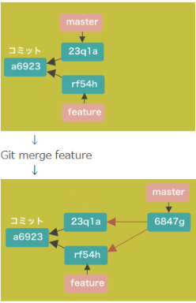

### コマンド
`git merge <ブランチ名>`		# ローカルで<ブランチ名>をHEADにマージ

`git merge <リモート名/ブランチ名>`		# フェッチしたリモートのブランチをHEADにマージ


## マージには3種類ある

## 1. Fast Forward: 早送りになるマージ  
ex.) 緊急のバグが発生して修正するケース	# 枝分かれせずにポインタが前にすすむ

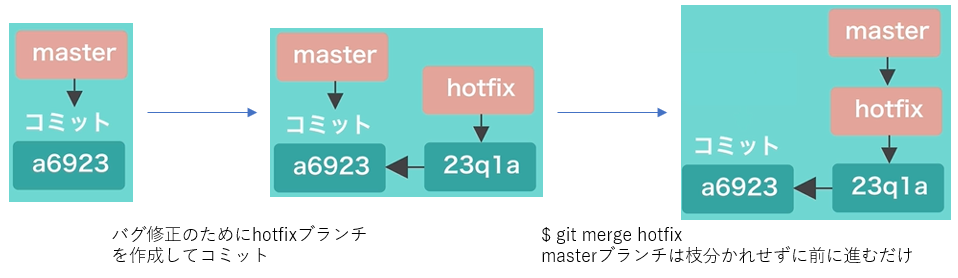

ログ例(一部抜粋)
```
Fast-forward
 index.html | 1 +
 1 file changed, 1 insertion(+)
```

## 2. Auto Merge: 基本的なマージ  
ex.) `git merge feature`	# masterブランチの内容をベースにして、featureブランチの変更分をスナップショットで取り込んでコミットを新しく作成している。  
このときに作成されるコミットは「マージコミット」と呼ばれ、親コミットの情報を2つ持っている特徴がある。


※ `git log --oneline`でマージによって新しいコミットが作成されていることが確認できる  
ログ例
```
107c0ff (HEAD -> master) Merge branch 'feature'
```

## 3. コンフリクトの解決
コンフリクトとは、他の人が別ブランチで同じ箇所に異なる変更を行ってマージするときに発生する事象。  
Gitでは判断ができなくなる。

### 解決方法
マージしてコンフリクトが発生した場合、下記のように出力される。※ マージは一応できている。
```
$ git merge feature
Auto-merging index.html
CONFLICT (content): Merge conflict in index.html
Automatic merge failed; fix conflicts and then commit the result.
```

#### 1. どのファイルでコンフリクトが発生しているか `git status` を確認する。
```
Unmerged paths:
  (use "git add <file>..." to mark resolution)
        both modified:   index.html				# index.htmlで両方が変更を加えていることがわかる
```

index.htmlを確認するとコンフリクトしている箇所が`<<<<<<< HEAD`と`>>>>>>> feature`で囲まれている。  
※VScodeでファイルの中身を見ると拡張機能でコンフリクトの選択ショートカットが表示されている。便利すぎ(感動!)
```
<p>index</p>
<p>git merge</p>
<<<<<<< HEAD
<p>コンフリクト</p>
=======
<p>conflict</p>
>>>>>>> feature
```

#### 2. どちらの変更を取り込むか選択して、`<<<HEAD`や`>>>feature`や`===`は削除する。

#### 3. あとは、通常通りコミットすればOK。`git status`の見た目は変わっていないが気にしない。


## コンフリクトが起きないようにするには?

### コンフリクト関連の事故が起きにくい運用ルール
- 複数人で同じファイルを変更しない ※これでそもそも解決する
- pullやmergeする前に変更中の状態をなくしておく (commitやstashをしておく)
- pullするときは、pullするブランチに移動してからpullする
- コンフリクトしても慌てない (落ち着けばむずかしくはない)


## ブランチを変更・削除しよう

### コマンド

`git branch -m <ブランチ名>`	# 自分が作業しているブランチの名前を変更する

`git branch -d <ブランチ名>`	# masterにマージされていない変更が残っている場合削除しない

`git branch -D <ブランチ名>`	# 強制削除する


## ブランチを利用した開発の流れ
- **masterブランチ**: リリース用ブランチ  
開発はせず、常に最新のリリースを確認できる状態にしておく。  
masterブランチのコミットIDを指定することによって切り戻しもシンプルに実現可能となる。

- **topicブランチ**: 開発用ブランチ  
トピックに応じて、`topic1`, `topic2`という風にブランチを作成する。  
masterにマージした後、別トピックでブランチを作成する場合は`topic3`という風に命名する。

## ブランチ間の差分の確認【参考】


### ブランチ間の差分を見たい

```
$ git diff [ブランチ名A] [ブランチ名B]
```

使用例

```
$ git diff master develop 
```

ブランチAの方がBより古い扱いで差分が表示される。

### リモートブランチとの比較

```
$ git diff origin/dvelop fix_routes
```

リモートブランチのdevelopとローカルのfix\_routesを比較する。

### 更新行数を取得

```
$ git diff master develop --shortstat
 7 files changed, 502 insertions(+), 1 deletion(-)
```

オプション"--shortstat"をつけると、ブランチ間の更新行数を比較できる。


## リモートブランチとは?
リモートブランチはリモートのブランチの状態へのポインタ。
<リモート>/<ブランチ>で参照できる。

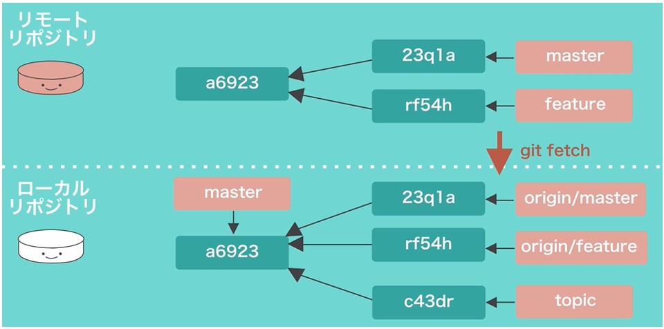

尚、ブランチ名は`git branch -a`で確認すると下記のようになっているが、
```
  remotes/origin/feature
  remotes/origin/master
```
マージするときは、`remotes/`を省いて、`git merge origin/master`でOK


*****************************************************************************************************************
# 4/29
# GitHubを利用した開発手順の流れ

## プルリクエスト
自分の変更したコードをリポジトリに取り込んでもらえるよう依頼する機能。  

### コマンド
`git push <リモート名> <ブランチ名>`

-> ex.) `git push origin topic`

## プルリクエスト の流れ

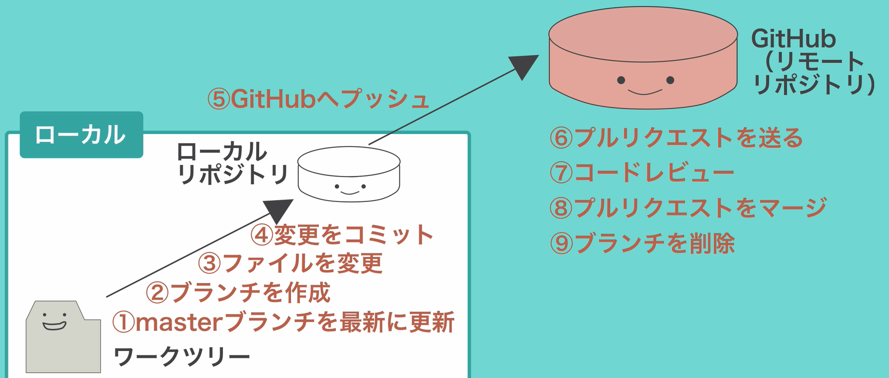


#### GitHub画面 プルリクエストの作成 ~ コードレビュー
1. Pull Repuestタブ
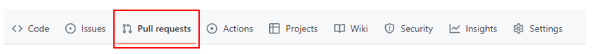

2. `New pull request`をクリックする  


3. `compare`で統合させたいブランチを選択して、`Create pull request`をクリックする
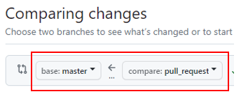


4. タイトル / 本文を書いて、プルリクエストを作成する  


5. コードレビューを依頼する  

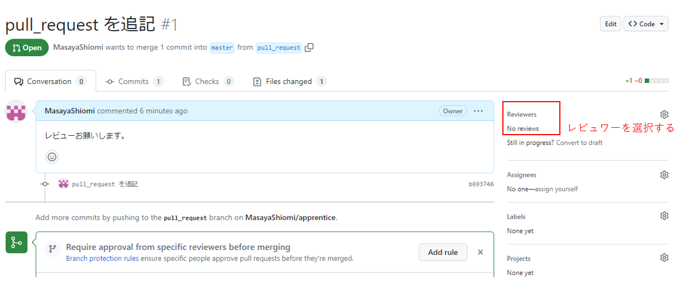

#### レビュワー側
1. Files chaged タブ
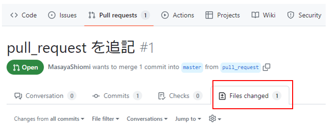

2. レビュワーがコメントをするとプルリクエストをした人に通知がいくので、修正してプルリクエストをする。承認されるまで繰り返す。
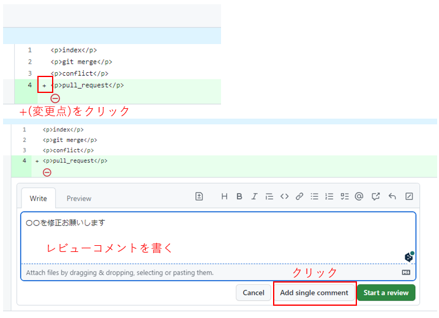


3. レビューが通ったら、Files chaged タブから Review Changesを選択して、Approve(承認) する。

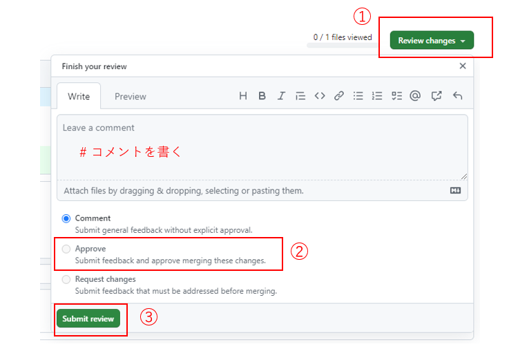

4. Merge pull request -> Confiem merge をクリックする
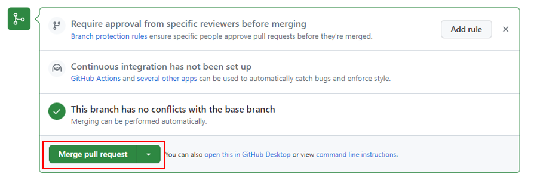
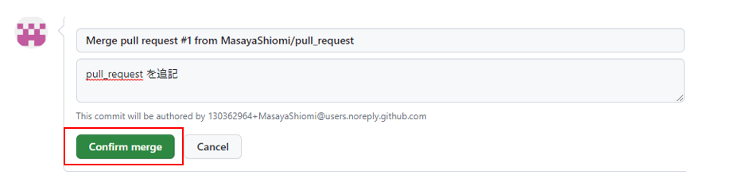

5. プルリクエストを削除する
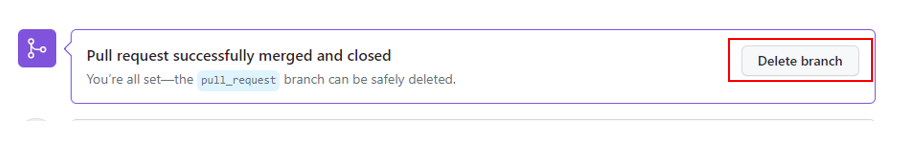

ここまでで、プルリクエストをコードレビューしてリモートリポジトリに取り込むことができた。

6. ローカルに反映させる
`git checkout master`		# masterブランチに切り替える

`git pull origin master`	# masterブランチに取り込む

※不要なブランチであれば削除する
`git branch -d <ブランチ名>`

## masterブランチの更新を忘れて作業していた・・・【余談】
プルリクエストしたけど色々あって、コンフリクトも起きてるし、とりあえず一気にリモートリポジトリのコミットをmasterにしたい!!!

最新ではないmasterブランチをもとに分岐したブランチで作業してプルリクエストしたため、コンフリクトが発生しているケース。

1. 既存のmasterぶらんちを削除する

`git branch -D master`

2. リモートリポジトリを取得する
`git fetch`

3. リモートリポジトリを元にmasterを作成する
`git branch master origin/master`

4. 作業ブランチにmasterをマージする。コンフリクトしてるよーと表示される。
`git merge master`

5. コンフリクトを解消して、コミットする。

6. 作業用ブランチでプルリクエストする。

## GitHub Flow の流れ
GitHub社のシンプルなワークフロー

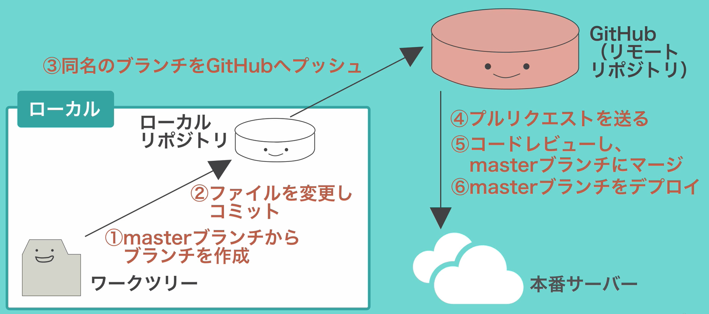

### GitHub Flowを実践する上でのポイント
- masterブランチは常にデプロイできる状態に保つ
- 新開発はmasterブランチから新しいブランチを作成してスタート
- 作成した新しいブランチ上で作業しコミットする
- 定期的にプッシュする
- masterにマージするためにプルリクエストを使う
- 必ずレビューを受ける
- masterブランチにマージしたらすぐにデプロイする ※テストとデプロイは自動化


## GitHub Flow を実践しよう

1. masterブランチへ移動する`git checkout master`
2. 変更が行われていないことを確認する`git status`
3. プルしてリモートと同じ最新コミットであることを確認する`git pull origin master`
4. 新しいブランチを作成する`git branch -b <新ブランチ名>`
5. 変更分をコミットしてプッシュする
6. プルリクエストを作成して、レビューを依頼する
7. コードレビューと修正(プルリクエスト)を繰り返す
8. ブランチをマージして、不要となったブランチは削除する
9. ローカルのmasterブランチを最新にする
10. 開発用ブランチを削除する


# リベースで変更履歴を修正しよう
## リベースとは
変更を統合する際に、履歴をきれいに整えるために使う

※マージと似て異なる

### コマンド
`git rebase <ブランチ名>`		# ブランチの起点となるコミットを別のコミットに移動する

### 流れ

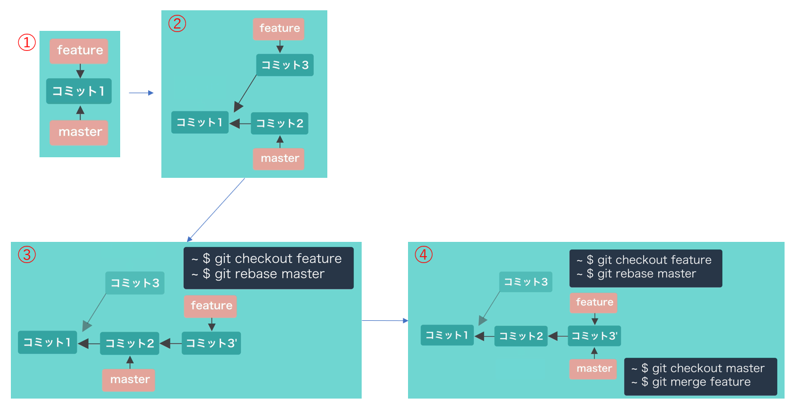

### リベースとマージの違い

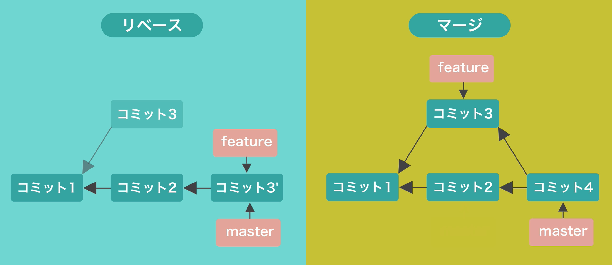

リベースでは、履歴は一直線になる。(Fast-Forward)


## Fast Forwardをしない設定【余談】
師匠の設定。

別のブランチの変更もすべてコミットとして記録するためにFast Forwardをできないようにしたい場合。

### コマンド
`git config --global merge.ff false`


## リベースでしてはいけないこと
GitHubにプッシュしたコミットをリベースするのはNG


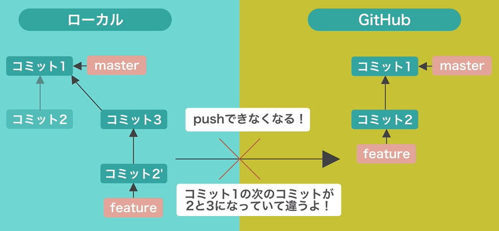

### `git push -f` は絶対NG!!


## リベースとマージの使い分け
運用方針による

### メリット・デメリット

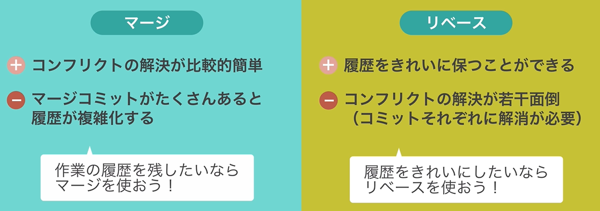

### コンフリクトの違い

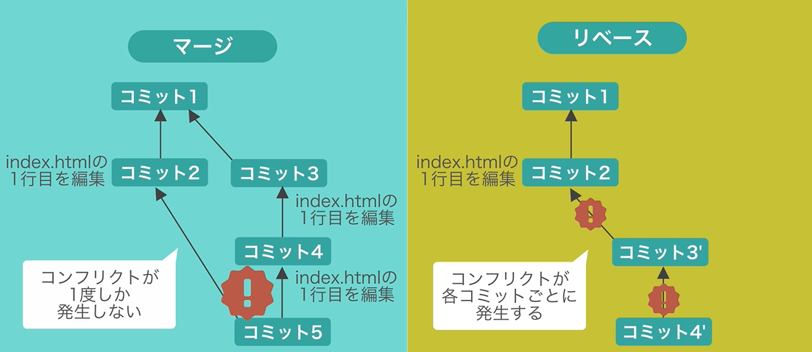

### 運用例
- プッシュしていないローカルの変更にはリベースを使い、
プッシュした後はマージを使う。

- コンフリクトしそうならマージを使う。  
(他の人が何をしているか分からない場合、プルリクエストするとコンフリクトしているか分かる)


## プルの設定をリベースに変更する
プルにはマージ型とリベース型がある。

リベース型がおすすめ。

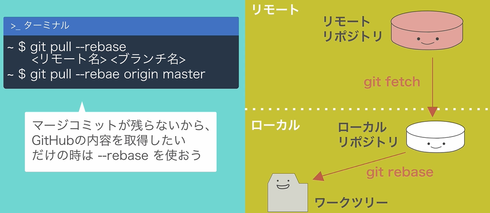

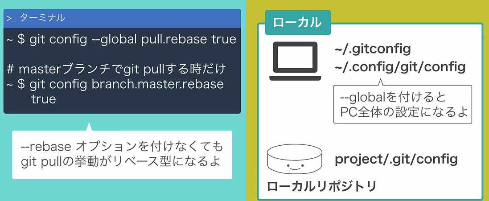

個人的には、masterブランチのみリベース型のプルで設定したい
-> `git config branch.master.rebase true`


## リベースで履歴を書き換える① 過去の履歴を修正
コミットをきれいに整えてからプッシュしたいとき

※ GitHubにプッシュする前であることが前提

### コマンド
`git commit --amend`		# 直前のコミットをやり直すとき

`git rebase -i <コミットID>`	#	複数のコミットをやり直す	# `-i` でコミットエディタ起動  
-> ex.) `git rebase -i HEAD~3`	#	3つ遡ってコミットをやり直す

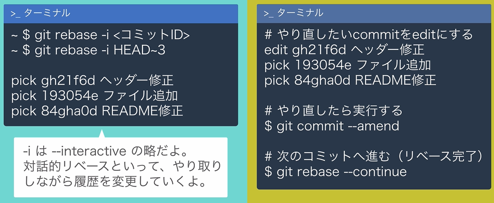

### 一連の流れ
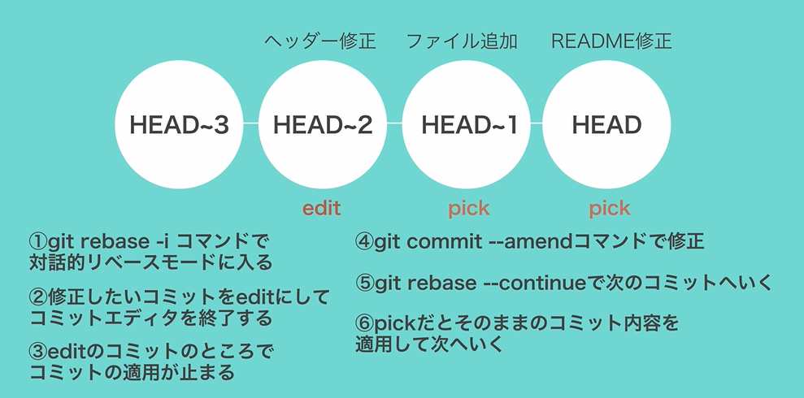


## リベースで履歴を書き換える② コミットの並び替え / 統合 / 分割

### コミットを並び替える、削除する
`git rebase -i HEAD~3`コマンドでコミットエディタを起動して削除したり並び替えたりできる。
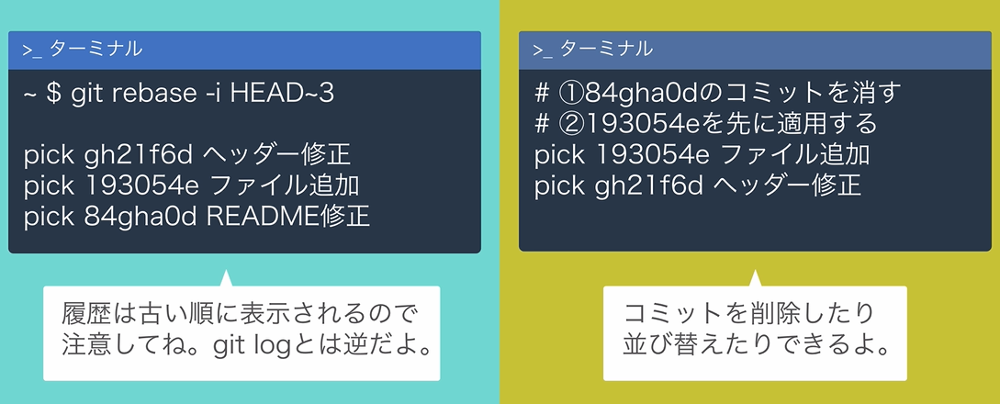


### コミットをまとめる
まとめたいコミットを`pick`から`squash`に変更する
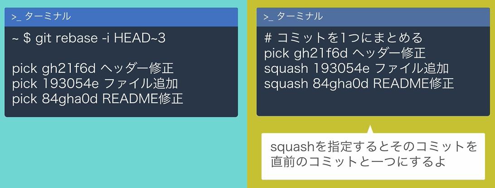


### コミットを分割する
分割したいコミットを`pick`から`edit`に変更する。  
`git reset HEAD`でステージングしていない状態にして、変更してステージングする。
`git rebase --continue`するまで分割され続ける。

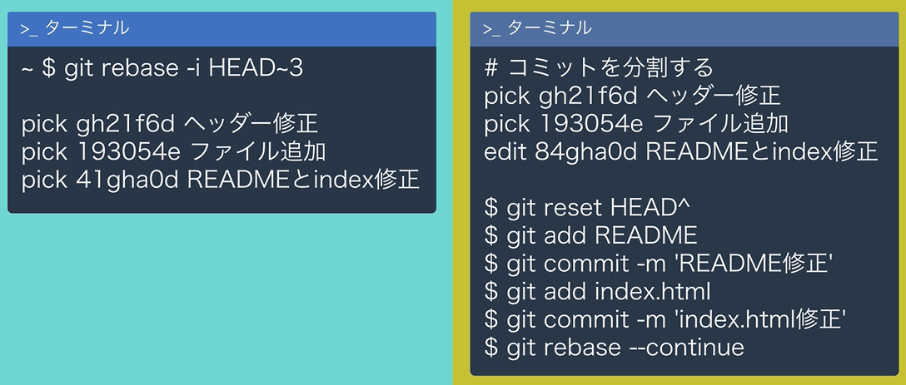


## ローカルの履歴とGitHubの履歴を比べたいとき【余談】
`git log --oneline`とGitHub上の履歴を見比べる

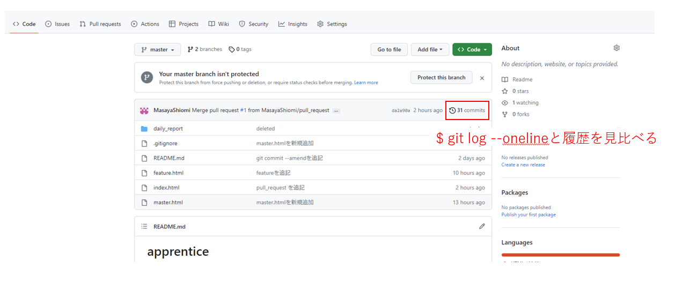


# タグ付けをしよう
コミットを参照しやすくするためにわかりやすい名前を付けるのがタグ。

リリースポイントにタグをつけることでバグが発生したときに切り戻ししやすかったり、リリースの内容を把握しやすくなる。

タグは複数付けることもできるらしい。

## タグの一覧を表示する
`git tag`		# アルファベット順にすべてのタグを表示

`git tag -l "201705"`		# `-l`(エル) パターンを指定してタグを表示

## タグを作成する
タグには、注釈付き(annotated)版と軽量(lightweight)版の2種類がある。

基本的に注釈付きを使う。

### 注釈付きタグ
タグ名、コメント、署名が付けられる。

`git tag -a [タグ名] -m "[メッセージ]"`		# -mは省略可。	その場合、エディタが起動する

-> ex.) `git tag -a 20170520_01 -m "version 20170520_01"`


### 軽量タグ
タグ名のみ。

`git tag [タグ名]`

`git tag [タグ名] [コミッID]`		# 以前のコミットにタグ付けする
-> ex.) `git tag 20170520_01 8a6cbc4`


### タグのデータを表示する
`git show [タグ名]`


## タグをリモートリポジトリに送信する
タグをリモートに送信するには`git push`コマンドで別途指定する

`git push [リモート名] [タグ名]`
-> ex.) `git push origin test_tag`

### GitHubでタグを確認する方法
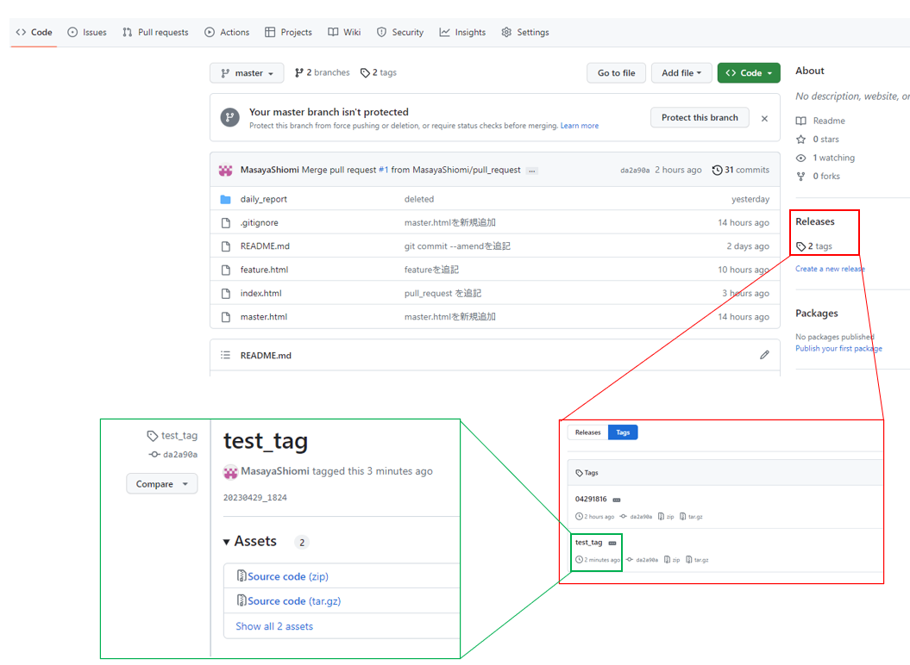


# スタッシュで作業を一次避難しよう
作業が途中でコミットしたくないけど別のブランチで作業しないといけない。  
そういう時に作業を一時避難する。

## 作業を一次避難しよう
`git stash`

`git stash save`		# 同じコマンド

stashは「隠す」という意味。

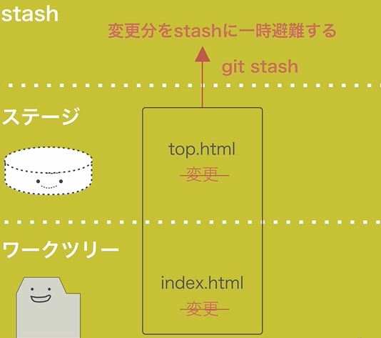


## 避難した作業を確認しよう
`git stash list`


## 避難した作業を復元しよう
`git stash apply`		# 最新を復元。ただし、ステージの状況は復元しないため書きを使用する

`git stash apply --index`		# スタッシュの状況も復元する

`git stash apply [スタッシュ名]`
-> ex.) `git stash apply stash@{1}`


## 避難した作業を削除しよう

`git stash drop`	# 最新のみ削除

`git stash drop [スタッシュ名]`	# 特定の作業を削除
-> ex.) `git stash drop stash@{1}`

`git stash drop clear`		# 全作業を削除
